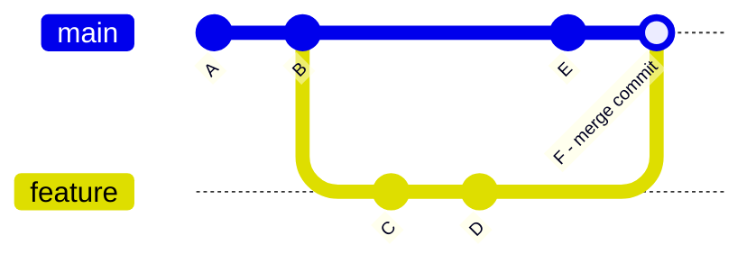
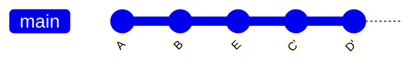

# Branches

## Visualisation

```bash
git branch # afficher les branches locales
git branch -a # afficher les branches locales et distantes
git branch -r # afficher uniquement les branches distantes
```

::: tip Astuce
La liste des branches distantes n'est pas rafraîchie automatiquement. Faire un `git fetch` avant `git branch -r` pour voir les branches créées récemment côté serveur.
:::

## Création

```bash
git branch <name> # créer une branche
```

## Navigation

```bash
git checkout <name> # changer de branche
```

## Fusion

- Avec `merge`, l'historique des deux branches est conservé et un commit de fusion apparaît :

```bash
git merge <feature>
```



- Avec `rebase`, les commits de la branche sont rejoués un par un au-dessus de `main`, ce qui donne un historique linéaire sans commit de fusion :

```bash
git rebase <feature>
```



## Suppression

```bash
git branch -d <name> # suppression locale si déjà mergée
git branch -D <name> # suppression locale, même non mergée
git push origin --delete <name> # suppression distante
```

Après suppression côté serveur, nettoyer les références locales devenues obsolètes :

```bash
git fetch --prune
```
