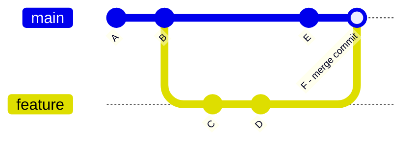
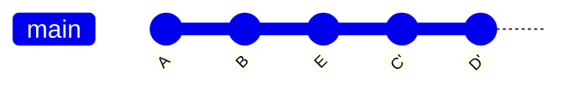

# Branches

## Git branch

```bash
git branch # afficher les branches locales
git branch -a # afficher les branches locales et distantes
git branch <name> # créer une branche
```
## Git checkout

```bash
git checkout <name> # changer de branche
```

## Git merge

Fusionner une branche en créant un commit de fusion.

```bash
git merge <feature>
```

**Avec `merge`**, l'historique des deux branches est conservé et un commit de fusion apparaît :



Fusionner une branche en conservant un historique linéaire (rejoue les commits par-dessus).

```bash
git rebase <feature>
```

**Avec `rebase`**, les commits de la branche sont rejoués un par un au-dessus de `main`, ce qui donne un historique linéaire sans commit de fusion :



Supprimer une branche locale.

```bash
git branch -d <name>
```
