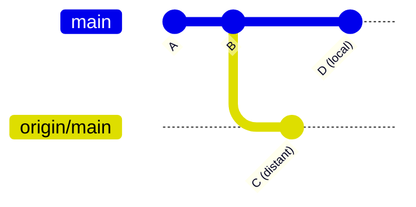
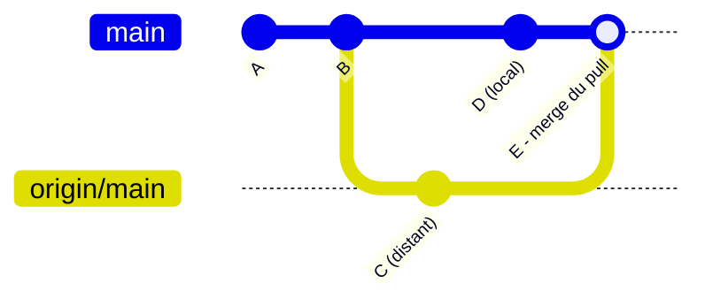

# Synchronisation

## Git fetch

Récupérer les modifications du dépôt distant sans les fusionner.

```bash
git fetch
```

**Avec `fetch`**, les nouveaux commits distants sont téléchargés (`origin/main`) mais la branche locale (`main`) n'est pas touchée : les deux historiques divergent, sans fusion automatique.



## Git pull

Récupérer et fusionner les modifications du dépôt distant.

```bash
git pull
```

Avec `pull` (`fetch` + `merge` par défaut), les commits distants sont récupérés puis directement fusionnés dans la branche locale, avec un commit de fusion si les deux ont divergé :



::: tip Astuce
`git pull --rebase` fait la même chose mais rejoue tes commits locaux par-dessus les commits distants au lieu de créer un commit de fusion, pour un historique linéaire.
:::
